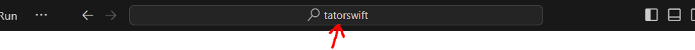
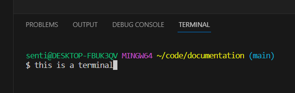

# Drive Practice Setup for Mechanical Students
<h4>AKA How To Get The Robot To Drive Without Being A Programmer</h4>

```java
// TODO intro
```

## Step 0: Login
1. Log in to the laptop with the PIN of 2122.
2. Connect to a mobile hotspot or a Wi-Fi with actual internet (not the robot).

## Step 1: Open the Robot Project
1. Open the "{this year} WPILib VS Code" (e.g. 2024 WPILib VS Code)
2. Check the top of the window:  
    
  If it has the [name of the robot you're working with](Robot%20Names.md), great. Otherwise, check File > Open Recent for the repo, else File > Open Folder and open whichever one of these paths exists:
    - `C:\Code\<robot name here>`
    - `C:\Users\senti\Code\<robot name here>`
    - `C:\Users\<other users>\Code\<robot name here>`  
  If none exist, it may not be on that laptop. Check the other one.

<div style="page-break-after: always"></div>  

## Step 2: Fetch


1. Once you have the correct robot code open, press <kbd>Ctrl</kbd>+<kbd>Shift</kbd>+<kbd>\`</kbd> to open a terminal.
2. Type `git fetch` into the terminal (at the bottom) and press <kbd>Enter</kbd>.
3. Check the output:
   - If it has `Could not resolve hostname`, make sure you're connected to the internet and try again.
   - If the last line is like `Unpacking objects: 100% (XX/XX), XX.XX KiB | X.XX MiB/s, done.`, you've successfully fetched. Continue to the next step.
   - If there was no output (if it just gave you another prompt), you're already up to date. Continue to the next step.

## Step 3: Select Tag
1. With the terminal still open, type in `git tag` and press <kbd>Enter</kbd>.
2. It should list tags from newest to oldest. Note the name of the most recent (topmost) one with a name containing "drive practice" or something similar.
3. Type in `git checkout <name of tag>` and press <kbd>Enter</kbd>.
4. Check the output:
   - If it ends with `HEAD is now at <whatever>`, you're good. Continue to the next step.
   - If it ends with `Please commit your changes or stash them before you switch branches.`, type `git stash`, hit <kbd>Enter</kbd>, and retry the checkout.
   - If it starts with `error: you need to resolve your current index first`, type `git add .` and hit <kbd>Enter</kbd>. Then type `git stash`, hit <kbd>Enter</kbd>, complain to Programming for leaving you a merge conflict, then try the checkout again.

<div style="page-break-after: always"></div>  

## Step 4: Deploy
1. Find the WPILib \<W> near the upper right and click it:  
     

   If the button isn't present, open the Command Palette with <kbd>Ctrl</kbd>+<kbd>Shift</kbd>+<kbd>P</kbd>

2. Find the "WPILib: Deploy Robot Code" option (if you opened the command palette, you can type in "wpilib" and it should show up) and click it.
3. If it asks you to "Pick a language", choose Java.
4. Wait for it to deploy, and check the output:
    - If it ends with <b><code style="color: #0c0">BUILD SUCCESSFUL</code></b>, the code deployed. Continue to the next step.
    - If it ends with <b><code style="color: #c20">BUILD FAILED</code></b>, the deploy failed. Look through the output and find `* What went wrong:` to see why (you may need to scroll):
      - `Execution failed for task ':discoverroborio'.`: You aren't connected to the robot.
      - `Execution failed for task ':compileJava'.`: There's an error in the code. Go back to a terminal, type `git stash`, hit <kbd>Enter</kbd>, and then try again. If it still fails, contact Programming.
      - Anything else: Hopefully the message is helpful?

## Step 5: Drive
1. Open the *FRC Driver Station* app.
2. Verify that the robot is connected and has code loaded ("Communications" and "Robot Code" should both have fully green boxes next to them)
3. Switch to the Devices tab () (on the left, USB icon) and make sure that your driver controller appears on slot 0 (pressing buttons should make it light up), and your gunner controller (if any) on slot 1. If not, drag and drop to reorder.
4. Make sure you can easily hit <kbd>Enter</kbd> (disable) or <kbd>Space</kbd> (E-stop) if needed. (If you E-Stop, you'll need to redeploy the robot code.)
5. Switch back to the Operation tab (), select TeleOperated mode, and press Enable to start the robot.
