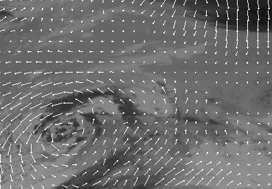

title: Repulsor Field Planner

# Repulsor Field Planner or: Obstacle Avoidance via Vector Field

## Introduction
`RepulsorFieldPlanner.java` is a file used in the codebase of a robot that
calculates what direction to go in order to reach a goal on the field, given the
fact that there are obstacles in the way. A lot of the math may seem
unapproachable or overwhelming at first, but so long as you're willing to put
some effort into reading this document and learning some things, I'm sure you'll
see it's not too bad.

This document is designed to help a student, whether rookie or veteran,
mathematically inclined or averse, understand what `RepulsorFieldPlanner.java`
is meant to solve, how it solves that problem, and how to use it. Please be
inclined to ask questions to mentors or other students should you have any
questions or confusions. The team is here to help you, and so is this document.

## What is `RepulsorFieldPlanner.java`?

Originally designed during the 2025 competition season, the file arose from the
wider FRC community, not specifically from Team Tators. In particular, the
original derivation ([which can be found
here](https://github.com/icrobotics-team167/2025_Reefscape/blob/main/src/main/java/frc/cotc/drive/RepulsorFieldPlanner.java))
used in our codebase comes from Children of the Corn, team \#167. This document,
however, is unique to our team. In 2025, there was a large hexagonal obstacle in
the middle of each alliance's side of the field that the robot had to place on,
and it was soon realized that automating the entire placement process (i.e. the
robot takes control of driving the moment a gamepiece was picked) would be a lot
faster than the standard manual driving approach employed in years past.
However, the easy way of driving in a straight line from point A to point B
wouldn't quite cut it, since, as mentioned previously, there was a large
hexagonal obstacle in the way. Thus, obstacle avoidance was born.

## How Does `RepulsorFieldPlanner.java` Work?

But how does one avoid obstacles? It's a somewhat difficult problem to think
about, really. In the past, the typical approach to driving to a point, not
considering obstacles, was to just use a simple PID control loop on your robot's
position to drive it to a specific point. The new idea amongst the community was
to define something called a [vector
field](https://math.libretexts.org/Bookshelves/Calculus/Calculus_(OpenStax)/16%3A_Vector_Calculus/16.01%3A_Vector_Fields)
to represent the field.

### Intro to Vector Fields

If you're somebody who has not taken calculus yet, then that link leading to a
calculus textbook may seem scary. If you want to continue learning and
improving, you need to eviscerate that thought and eject it far from your
soul. I've been there, and I can tell you the thought of "this math is too
complicated" is not true. A vector field is literally just a bunch of arrows
that point somewhere. Some arrows are longer than others, and so they're
stronger than the other arrows, and whatever thing is there will experience a
greater force in that direction. Why this is considered high level math is
beyond me.

Vector fields are used widely in mathematics and physics, such as when modelling
a gravitational or magnetic field, but they are conceptually easy to
understand. If you've taken AP Calculus, you might be familiar with a slope
field, which is close to what a vector field is. Slope fields define the
direction for a function to travel, while a vector field defines the direction
and strength with which to follow, as vectors have direction and magnitude.

For example, look at the following gif, and glance upon the many arrows drawn in
the hurricane. Now imagine you're something in that hurricane. Pick a point and
try following its path with your finger. Pay attention to the speed and
direction of your movement, and see how it matches up with the length and
direction of the arrows near your finger. This is the same way the robot follows
the vector fields defined in `RepulsorFieldPlanner.java`.



Keep in mind that, although vector fields are often visualized with grids of
arrows whose positions are fixed, a vector field is typically a
<ins>continuous</ins> function, and the grid of arrows is simply an easy way to
visualize a function $\vec{F}(x, y)$, where $\vec{F}$ is a vector with
direction and magnitude in a two dimensional plane. The visual grid of arrows is
not a literal definition of a vector field, but more just a helpful way to
visualize many outputs of a continuous function.

### Visualization

To visualize the vector field you're creating, there's a function in
`RepulsorFieldPlanner.java` called `getArrows()`, which returns an array of
`Pose2d`s. When logged properly (this logging should only happen in simulation,
as the computation is somewhat expensive), the array can be visualized in
[AdvantageScope](https://docs.advantagescope.org/)'s odometry or 3D field
tab. For reasons explained below, there are three different types of vector
fields one can draw: goal, obstacle, and sum. The `VectorField` enum can be
passed into `getArrows` to determine which field to visualize.

Another point of note is that, due to technical limitations in
[AdvantageScope](https://docs.advantagescope.org/), the strength of vectors
cannot be visualized. Only `Pose2d`s have translational and rotational data that
can be visualized, but a `Pose2d` is meant to depict a point, not a vector, and
thus has no way to configure the strength of the vector depicted by one.

### Final Algorithm

There are really two vector fields at play here. There is a vector field that
points away from obstacles, and there is a vector field that points toward the
goal. They use an inverse square ($\vec{F} \propto \frac{1}{x^2}$) and
proportional strength ($\vec{F} \propto x$) relationship, respectively. Thus,
the closer to an obstacle the robot is, the harder it will drive away, and the
closer the robot is to the goal, the less it will drive towards it.

The final vector is computed by simply adding the resultant vector from each
field together, like so:

1. Compute the vector from field obstacle vector field
2. Compute the vector from goal position vector field
3. Add these two vectors together
    
The final step produces a vector that both drives the robot away from obstacles
and drives toward a goal. Step 1 is represented by the function
`getObstacleForce()`, step 2 by `getGoalForce()`, and step 3 by `getForce()` in
the code. It really is that simple.

## How Do I Use `RepulsorFieldPlanner.java`?

A few things have to happen before one can avoid obstacles. First, create a
repulsor where you plan on using one (typically just within the drive subsystem).

``` java
RepulsorFieldPlanner repulsor = new RepulsorFieldPlanner();
```

Next, when you want to declare where to travel to, you must tell the repulsor
where that is.

```java
// `goal` here is a Pose2d that is assumed to be already known
repulsor.setGoal(goal.getTranslation());
```

Finally, the repulsor has to be periodically sampled, since the robot is
constantly moving throughout the vector field, changing the vector
calculated. `sampleField` is a function that will return a `RepulsorSample`,
which is a custom data type that does nothing more than hold three values:
`intermediateGoal`, `vx`, and `vy`. `vx` and `vy` can be used as feedforward
values for the robot velocity, and `intermediateGoal` can be used in a feedback
loop to compute a more accurate following of the vector field. If you do not
know what "feedforward" or "feedback" are, please refer to [this useful page on
control theory in the WPILib
documentation](https://docs.wpilib.org/en/stable/docs/software/advanced-controls/introduction/control-system-basics.html#block-diagrams)
(the provided link points to block diagrams, as that's where feedforward (or
"open-loop") and feedback ("closed-loop") are diagrammed, but the entire page is
worth a read)

```java
/* this entire snippet should be called periodically */

Pose2d pose = getPose();

RepulsorSample sample = repulsor.sampleField(
    pose.getTranslation(), // translational position of the robot
    3.5, // max speed of the robot in meters per second when following the vector field
    0.8 // distance of the robot in meters from the goal before linearly interpolating a slowdown to 0 m/s
);

ChassisSpeeds feedforward = new ChassisSpeeds(sample.vx(), sample.vy(), 0);

ChassisSpeeds feedback = new ChassisSpeeds(
    transController.calculate(
        pose.getTranslation().getX(),
        sample.intermediateGoal().getX()),
    transController.calculate(
        pose.getTranslation().getY(),
        sample.intermediateGoal().getY()),
    rotController.calculate(
        pose.getTranslation().getRotation().getRadians(),
        goal.getRotation().getRadians())
);

ChassisSpeeds output = feedforward.plus(feedback);
```

And then, if you actually use the `output` object, you will have obstacle
avoidance. It wasn't that hard, right?

## Adapting From Year to Year

`RepulsorFieldPlanner.java` has many different obstacle types defined in it, but
you may need to formulate more depending on the field. For example,
`TeardropObstacle` is a pretty unique shape (sort of like "c>", like a
raindrop), but forces the robot to move to the sides of a circular obstacle
should the goal be on the opposite end of the obstacle from the robot. This was
used to model the reef in the 2025 onseason. The reef was a big hexagon, so you
may have to get creative with how you model obstacles to get a satisfactory
result.

It's also important that the obstacles be modified from year to year. Don't
assume that copying the file verbatim from last year will work, since the robot
will be avoiding last year's obstacles. It's likely there will be a file out
there somewhere in the community (such as from 3173, 6995, or 167), so don't
feel as though you have to be a genius at modelling in order to get a working
solution. All obstacles should be defined as static objects near the
instantiation of last year's obstacles, and the strength of obstacles may need
to be tuned.
